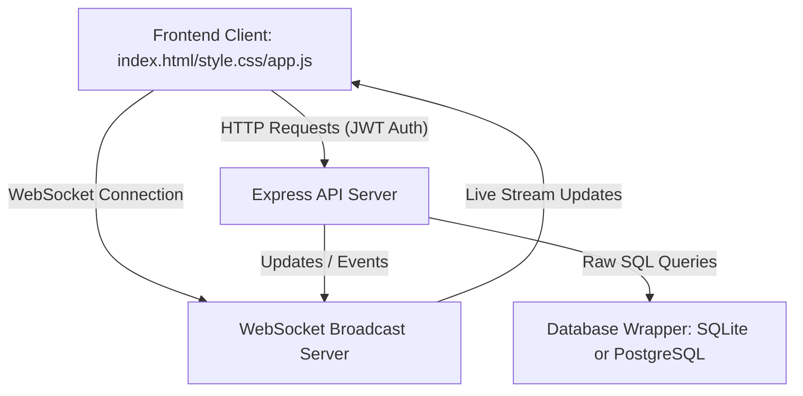
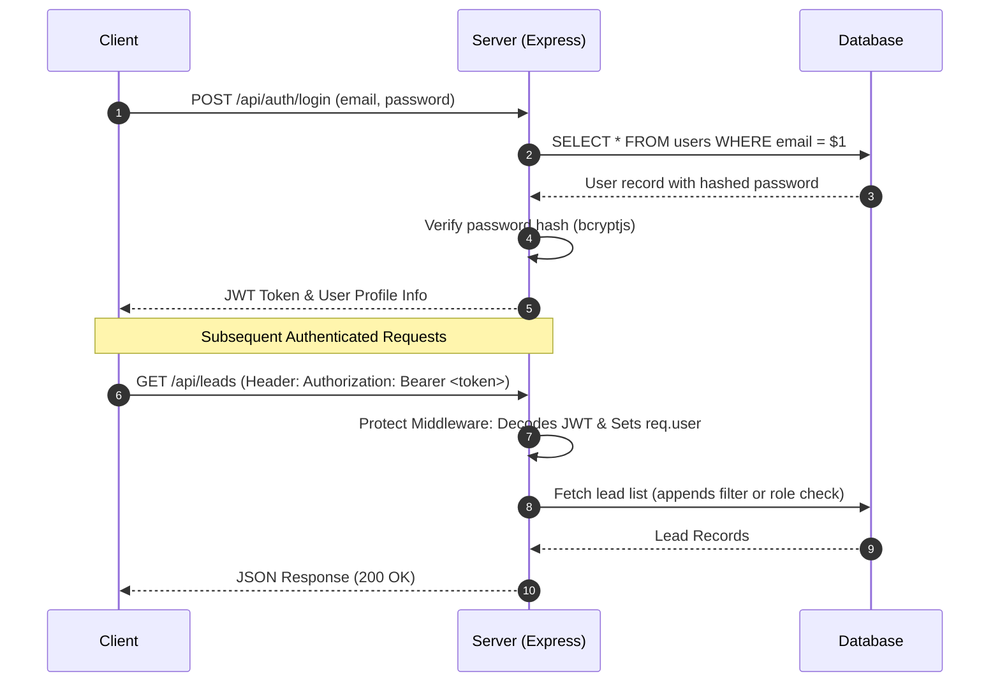
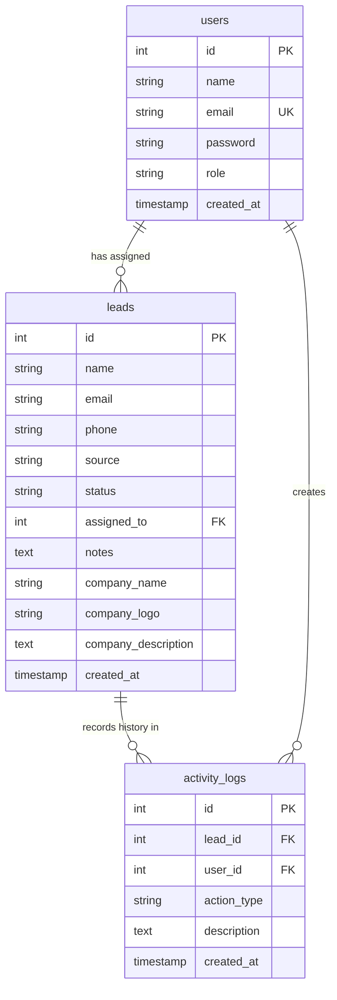

# Project Architecture & Design Documentation

This document explains the architecture decisions, folder structure, authentication flows, database designs, auto-assignment logic, and scalability considerations of the Mini Lead Management System.

---

## 1. Project Architecture
The application is designed as a **decoupled Client-Server architecture** with a thin-client frontend and a service-oriented backend:

```text
  ┌─────────────────────────────────────────────────────────────┐
  │                        FRONTEND CLIENT                      │
  │  (index.html + style.css + app.js via Vanilla Web APIs)     │
  └───────────────┬───────────────────────────────▲─────────────┘
                  │ HTTP Requests                 │ WebSocket
                  │ (fetch client)                │ Stream
                  ▼                               │
  ┌───────────────────────────────────────────────┴─────────────┐
  │                         BACKEND API                         │
  │     (Node.js + Express.js API & WS Broadcast Server)        │
  │                                                             │
  │  ┌──────────────┐   ┌───────────────┐   ┌────────────────┐  │
  │  │  Middleware  │   │  Controllers  │   │    Services    │  │
  │  │ (JWT checks) │   │ (CRUD, Auth)  │   │ (Enrich, Assign)  │  │
  │  └──────────────┘   └───────┬───────┘   └────────────────┘  │
  └─────────────────────────────┼───────────────────────────────┘
                                ▼
  ┌─────────────────────────────────────────────────────────────┐
  │                       DATABASE LAYER                        │
  │              (pg client / sqlite3 native pool)              │
  └─────────────────────────────────────────────────────────────┘
```



---

## 2. Directory Structure & Organization
The folder layout separates concerns logically, a standard pattern in modern production systems:

- **`backend/src/db/db.js`**: Database Connection Pooling. Implements dual compatibility, serving as a unified promise query interface.
- **`backend/src/middleware/auth.js`**: Route Protection Guard. Extracts JWT, validates signatures, retrieves the user profile, and enforces role authorization check blocks.
- **`backend/src/controllers/leadsController.js`**: Business Handler. Receives HTTP inputs, filters records based on active user roles, inserts audit logs, and invokes WebSocket notifications.
- **`backend/src/services/`**: Isolated Utilities. Services like auto-assignment logic and third-party enrichment APIs are separated to keep controllers clean.
- **`frontend/app.js`**: SPA Application Driver. Acts as the client-side state machine, handles views switching, performs API fetches, and maintains WebSocket connection.

---

## 3. Authentication & Authorization Flow
We implement standard **JWT-based stateless authentication**:

```text
  Client                    Server (Express)                 Database
    │                              │                            │
    │ 1. POST /login (credentials) │                            │
    ├─────────────────────────────>│ 2. Query user by email     │
    │                              ├───────────────────────────>│
    │                              │    Verify password hash    │
    │                              │<───────────────────────────┤
    │ 3. Returns Token + User      │                            │
    │<─────────────────────────────┤                            │
    │                              │                            │
    │ == Subsequent Authenticated Requests ==                   │
    │ 4. GET /leads (Bearer Token) │                            │
    ├─────────────────────────────>│ 5. Middleware decodes JWT  │
    │                              │    Sets req.user           │
    │                              │    Checks role permissions │
    │                              │    Executes CRUD query     │
    │                              ├───────────────────────────>│
    │ 6. JSON Lead Records         │<───────────────────────────┤
    │<─────────────────────────────┤                            │
```



### Role-Based Access Controls (RBAC)
We enforce RBAC at both **route levels** (via middleware) and **field levels** (inside controllers):
- **Admin & Manager**: Full permissions. Can create, read, update, and delete any lead, and modify assignees.
- **Agent**: Restricted permissions.
  - Can only query/view leads explicitly assigned to them.
  - Can only update the `status` and `notes` fields of their assigned leads. Attempting to change client names, phone numbers, or assignment throws a `403 Forbidden` response.

---

## 4. Database Design Decisions
We designed a normalized SQL schema focusing on relational integrity:



- **Foreign Keys**: The `leads` table references the `users` table via `assigned_to` (`ON DELETE SET NULL`). The `activity_logs` table references both `leads` and `users` (`ON DELETE CASCADE` on leads).
- **Indexing**: High-read columns (`status`, `source`, `assigned_to`) have SQL database indexes. This guarantees rapid query responses even when the leads repository grows to hundreds of thousands of rows.
- **SQLite/Postgres Duality**: Since Postgres requires local installation (often a barrier for freshers), our database interface operates on SQLite by default. A single environment variable swap switches it to enterprise Postgres.

---

## 5. Lead Auto-Assignment Logic
We chose the **Least-Loaded Agent** assignment algorithm:
- When a lead is created, the system triggers the assignment engine.
- We run a single grouped SQL query counting the active leads associated with each registered Agent:
  ```sql
  SELECT u.id, u.name, COUNT(l.id) AS lead_count
  FROM users u
  LEFT JOIN leads l ON u.id = l.assigned_to
  WHERE u.role = 'Agent'
  GROUP BY u.id
  ORDER BY lead_count ASC
  LIMIT 1
  ```
- This orders agents by current workload and returns the agent with the lowest load in a single database roundtrip.

---

## 6. Scalability & Extensibility Considerations
- **Pagination**: We implemented query cursor offset pagination (`LIMIT` / `OFFSET`) on the backend. This prevents memory overflows on both client and server when handling massive datasets.
- **Connection Pools**: Express utilizes connection pooling for PostgreSQL, reusing database connections to handle concurrent request surges.
- **Debounced Search**: Frontend input forms utilize a 400ms debounce buffer, avoiding API server spikes during rapid typing.

---

## 7. Challenges & Improvements
- **Windows Scripting Policies**: Running standard node commands initially failed due to Windows PowerShell script restriction parameters. This was resolved by targeting the command shell wrapper (`npm.cmd`).
- **Potential Upgrades**: With additional time, we could implement:
  - Redis caching for dashboard stats to further reduce DB reads.
  - Email alerts using Nodemailer to notify agents immediately when a lead is assigned to them.
